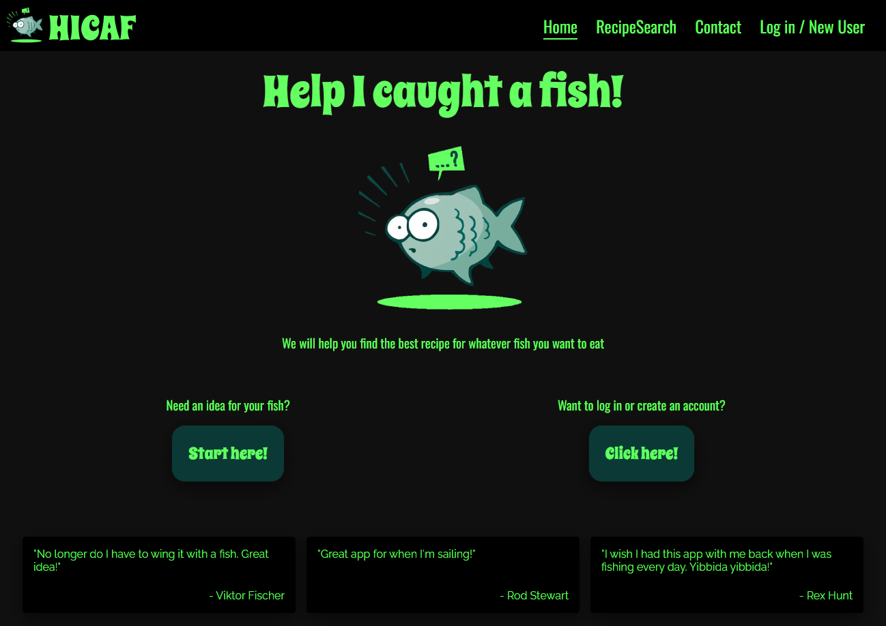

# Installatiehandleiding Help I caught a fish!

## Inhoudsopgave
1. [Inleiding](#inleidng)
2. [Screenshot](#screenshot)
3. [Benodigdheden](#benodigdheden)
4. [De applicatie draaien](#de-applicatie-draaien)
5. [Overige commandos](#overige-commandos)
6. [Testgebruikers](#testgebruikers)

## Inleiding

Soms gebeurt het dat je ineens met een hele of een stuk van een vis zit en geen idee hebt wat je ermee aan moet. Deze applicatie is bedoeld om je inspiratie te geven zodat je er een lekkere maaltijd van maakt. Je wordt gevraagd waar op de wereld je je bevindt en vervolgens kan je kiezen uit veel gevangen vissoorten van dat werelddeel. Ook kan je direct de Engelse naam voor een vissoort in de zoekbalk typen. Als je een account maakt of gebruikt, kan je favorieten opslaan en filters toepassen op de zoekresultaten. Met behulp van deze readme krijg je de applicatie draaiende en kan je hem uitproberen. Je mag alvast zelf verzinnen welke vis je in je koelkast klaar hebt liggen.

## Screenshot



## Benodigdheden

Dit project is gemaakt met [Vite](https://vitejs.dev/) (React versie 18.2.0).

Verder maakt het gebruik van de [Edamam API](https://www.edamam.com/).
De onderstaande Application ID  en Application key zitten al hardcoded in de applicatie.
```
Application ID:  c5ff97ab
Application key:  53223ed5c12039e77b08fc5f130446ce
```

Ook gebruikt dit project de [NOVI backend](https://novi.datavortex.nl/).
Onderstaande basis URI en API-Key zitten al hardcoded in de applicatie.
```
Basis URI: https://api.datavortex.nl/novibackendhicaf
API-Key:  novibackendhicaf:HxI8znYrdSresrrSUlRm
```
## De applicatie draaien

Download, kloon of unzip deze gehele applicatie eerst.
Run dan het volgende commando in je terminal:

```shell
npm install
```
Als dit erop zit, kan je de applicatie starten door het volgende in je terminal te typen:

```shell
npm run dev
```
Vervolgens klik je op de link die verschijnt in je terminal. Veel visplezier (naar recepten)!

## Overige commandos

Als je in je terminal melding krijgt dat er kwetsbaarheden zijn na het runnen van npm install, run dan het volgende:

```shell
npm audit fix
```

## Testgebruikers

Bij het ontwikkelen van deze applicatie zijn verscheidene test accounts gemaakt en gebruikt. 
Er is echter maar 1 test account in gebruik met admin rechten:
```
Gebruikersnaam: AdminAalDeRuyter
Wachtwoord: Vis12345
```
Ook zijn er al meerdere test accounts met alleen user rechten. Je kan met gemak zelf een nieuw account aanmaken. Mocht dit niet lukken of kunnen, dan kan je de volgende accounts gebruiken:
```
Gebruikersnaam: Kotter
Wachtwoord: Vis12345
```
```
Gebruikersnaam: toktok
Wachtwoord: Vis12345
```
NB: Er worden ook zeker weten andere wachtwoorden ondersteund!
